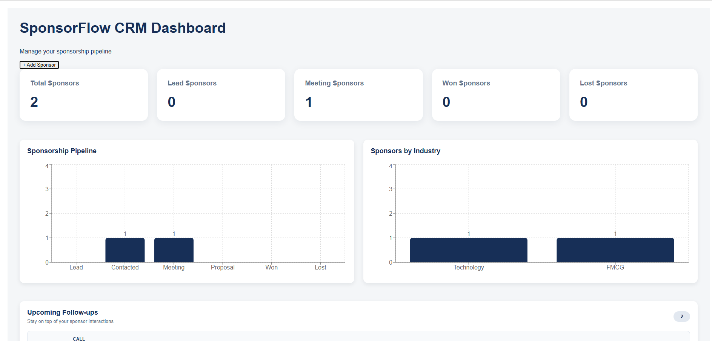

# SponsorFlowAI

> A full-stack sponsorship CRM for football clubs, sports organizations, events, and communities.

[](https://github.com/nitishchandran/sponsorflow-ai/actions)

🌐 **Live Demo:** https://sponsorflow-ai.vercel.app

📦 **Repository:** https://github.com/nitishchandran/sponsorflow-ai

---

## 🎯 What is SponsorFlowAI?

SponsorFlowAI is a full-stack CRM designed to help sports organizations manage their sponsorship pipeline from initial lead through successful conversion.

It provides a centralized workspace for managing sponsors, tracking sponsorship activities, following up with prospects, and visualizing the sponsorship pipeline.

The application was designed and deployed as a real-world full-stack application rather than a tutorial project.

---

## ✨ Features

### Sponsor Management

- Create sponsors
- Edit sponsor information
- Delete sponsors
- View detailed sponsor information
- Search sponsors by company name
- Filter sponsors
- Sort sponsors
- Paginate sponsor data

### Sponsorship Pipeline

Sponsors move through a CRM pipeline:

`LEAD → CONTACTED → MEETING → PROPOSAL → WON`

with support for:

- LOST

The Kanban board supports:

- Desktop drag-and-drop
- Mobile touch drag-and-drop
- Persistent pipeline status updates

### Activity Management

Track sponsor interactions including:

- Calls
- Emails
- Meetings
- Follow-ups
- Notes

Activities support:

- Activity dates
- Follow-up dates
- Activity history
- Editing
- Deletion

### Dashboard

The dashboard provides:

- Sponsor statistics
- Pipeline statistics
- Industry distribution
- Upcoming follow-ups
- Sponsor pipeline visualization

### Responsive UI

The application is designed for:

- Desktop
- Tablet
- Mobile

Mobile Kanban interactions use touch-based dragging in addition to desktop HTML drag-and-drop.

---

## 🏗️ Architecture

```text
                         ┌──────────────────────┐
                         │      React / Vite    │
                         │       Vercel         │
                         └──────────┬───────────┘
                                    │ HTTPS
                                    ▼
                         ┌──────────────────────┐
                         │    Spring Boot API   │
                         │        Render        │
                         └──────────┬───────────┘
                                    │
                         ┌──────────▼───────────┐
                         │     PostgreSQL       │
                         │        Neon          │
                         └──────────────────────┘


Development & Delivery

        GitHub
           │
           ▼
    GitHub Actions
           │
      ┌────┴────┐
      ▼         ▼
   Backend   Frontend
    Tests      Build
```
## 📸 Screenshots

### Dashboard

